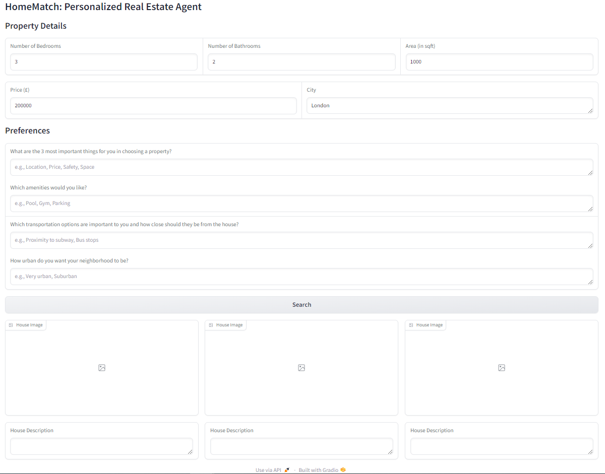
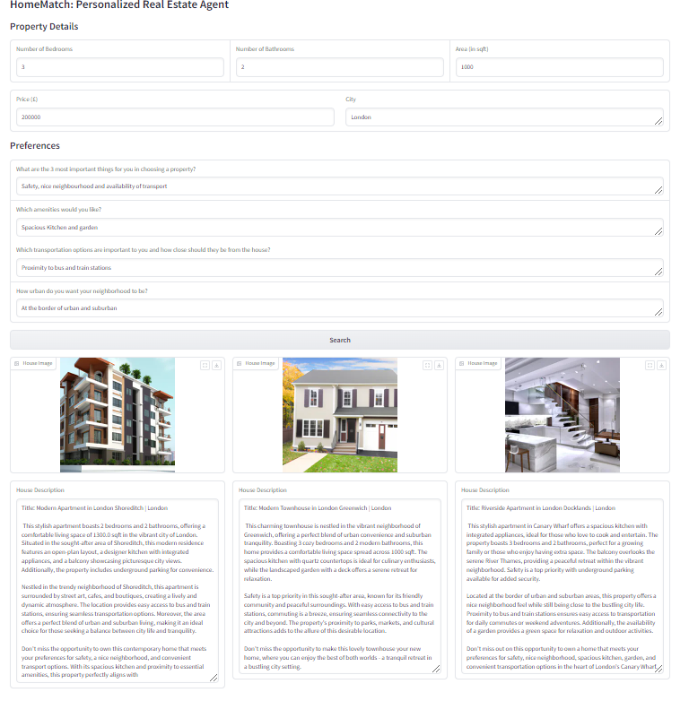

# Personalised Real State Agent

This repository contains implementation of a **Personalised Real State AI Agent**. 
It is an AI based real state recommendation system that utilises multimodal search capabilities of Large Language Models and Vision Models and
vector database for efficient searching and retrieval.

The application utilises synthetic real estate listings and real state images generated using OpenAI GPT models. The multimodal data
is converted to vectors using embedding models and then stored in a LanceDB vector database  for 
further semantic search capabilities. The system collects buyer preferences 
through structured questions or natural language input, allowing for personalized, 
interactive searches for properties. The preferences are processed and used 
to query the vector database for matching listings, retrieving relevant options based on 
semantic multimodal similarity. The application also includes functionality to dynamically augment 
listing descriptions with the LLM, tailoring them to better resonate with individual 
buyers' needs while ensuring factual integrity is maintained. The system is designed to be flexible,
 allowing users to input varied preferences and receive personalized, 
 augmented property listings in return.
 
 A notebook that shows how to use the real state agent is also provide (`real-state-matching.ipynb`).

Here is a detailed explanation of the components of the application
 
 ## 1. Synthetic Data Generation
 
 ### 1.1 Generate Generating Real Estate Listings with an LLM

Generating synthetic real estate house data involves creating realistic data entries 
that can be used for testing, analysis, or training machine learning models. Here’s a step-by-step guide on how to achieve this:

1. Create a prompt for the LLM
To generate synthetic data, you need to create a detailed prompt for a language model,
 such as those provided by LangChain or OpenAI. The prompt is a request that instructs 
 the model on what kind of data to generate.

2. Define the data format and features to generate: Specify the format in which you want 
the model to generate the data. Formats like CSV or JSON 
(JavaScript Object Notation) are preferred because they are structured and can be easily 
parsed. In this example, we’ll use JSON for its flexibility and readability. 
The features will be represented as columns or keys in the dataset.

3. Generate the synthetic data and parse it: The prompt is fed to the LLM to 
generate the data. The LLM output is text or string format and it need to be parsed 
into JSON format.


### 2.2 Generate Generating Real Estate Listings Images with Vision Language Model

We want our house matching AI agent to have multimodal search capability. Normally, real states have the image of the houses. Here, we generate image of the houses using `OpenAI DALL-E 2` [here](https://platform.openai.com/docs/api-reference/images/create) using the `openai.Image.create` endpoint.

This is a two step process:
1. The house description was formated from the generated data.
2. The house description was fed to OpenAI DALL-E pipeline to generate image.

Have a look the implementation of `generate_real_state_images(...)` function for detail.

## 2. Multimodal Semantic Search
To enable multimodal (semantic and visual search), the multimodal data embedding need to stored in a vector or embedding database.

### 2.1 Multimodal Embedding and Storing in a Vector Store
To enable effective multimodal search, we need to create embeddings for both text descriptions and images of houses. These embeddings will be used to store and retrieve data in a vector database. Below is a detailed explanation of the process:

#### Text Embedding
For text embedding, we use the CLIP text encoding model. While CLIP is convenient for combining with image embeddings, it has a limitation in that it supports a maximum context length of `77` tokens. This limitation can be problematic if house descriptions exceed this length.

**Steps to Handle Long Texts:**

1. Splitting: Split the house description into chunks, each containing no more than 77 tokens.
2. Embedding: Generate embeddings for each chunk using the CLIP text model.
3. Averaging: Compute the final text embedding by averaging the embeddings of these chunks. This approach ensures that the entire description is represented despite the token limit.

#### Image Embedding
For image embedding, we use the CLIP model, which provides a robust way to encode visual information into a vector representation.


For multimodal search, we need to `combine` the embedding text and image and store them in a vector database. These could be achieved in various methods:

1. Concatination: concatination of text and image embeddings to create one vector. This is the easiest way, but this results in a high dimensional vector which increase storage memory need and decrease retrieval performance.
2. Averaging: this is element-wise averaging of text and image embedding vectors. This create an embedding vector that equally represents both modality.
3. Weighted averaging: this strategy averages the embeddings based on their importance. For example, in house matching, `text` could have more importance than image since could explain their preference in detail than an image with similar features.

**`final_embedding = α * text_embedding + (1-α) * image_embedding**, where α=0.8. With real dataset, the value of α should be fine-tuned to improve search perfomrance.` α = 0.8 is chosen to give more importance to text embedding.

#### Normalization

Before combining text and image embeddings, it’s important to normalize the vectors. This ensures that they are on a similar scale and makes the combination process more effective. Here, we apply L2 normalisation of each embedding before combining.

## 3. Vector Database
- The semantic and visual embedding of images and text were store in database that allow vector search
- Lancedb library was used for vector database
- Indexing could be applied but here we have only limited number of data
- Here is the schema of the lance db vector database

```python
from lancedb.pydantic import Vector, LanceModel
class RealState(LanceModel):
    """
    A class representing a real estate listing with multimodal embeddings.

    Attributes:
        vector (Vector(512)): Multimodal embedding vector combining image and text data.
        bedrooms (int): Number of bedrooms in the property.
        bathrooms (int): Number of bathrooms in the property.
        area (float): Area of the property in square feet.
        zipcode (str): Postal code of the property's location.
        price (float): Listing price of the property.
        image (bytes): Image of the property in bytes format.
        title (str): Title of the property listing.
        city (str): City where the property is located.
        street (str): Street address of the property.
        description (str): Detailed description of the property.
    """

    vector: Vector(512)  # Multimodal embedding
    # img_vector: Vector(img_emb_dim)  # Image-only embedding (commented out)
    # text_vector: Vector(text_emb_dim)  # Text-only embedding (commented out)
    bedrooms: int
    bathrooms: int
    area: float
    zipcode: str
    price: float
    image: bytes
    title: str
    city: str
    street: str
    description: str
```

## 4. Collecting User Preference

For house matching, I implemented an app to collect user preference. 
The app is built in `gradio`. It can be found in (`house_matcher_app(...)`). 
The app allows users:
1. To enter and submit their preferences
2. Interactively visualise the search results matching with their description. 
The app shows both images and description.
 The app is connected to a house matching logic which 
 


## 5. Search Logic
The search logic accepts the user preference, generates vector embedding of the preference, finds and returns real estate listings that match user preferences by embedding the 
search query and comparing it with listings in a database. 
It uses both uses semantic search and SQL filtering to identify closely matching real states. 
It retrieves matching listings, along with their images. 

## 6. Augmented Response Generation

 The `generate_personalized_descriptions (...)` function in the `semantic_search_tools.py` file generates personalised 
 description for a real estate listing based on user preferences and the details of the listing. This was achieved in these steps:

1. Construct a prompt that includes details of the real estate listing and user preferences.
2. Inference using OpenAI LLM model a description based on the prompt.
3. Format the output for display on HouseMatch app.

Finally, the search and the augmented response generation logics provide images of the matching properties and a personalized description of the property according to the user preference. These are displayed on the app.



